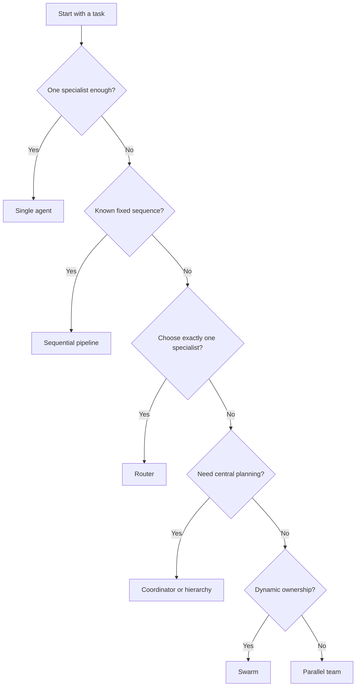

Build Chronos agents progressively—from one assistant to governed, multi-agent applications—using YAML and the CLI. The examples are split into focused pages so you can copy only the pattern you need.

## Learning path

| Level | What you build | Concepts | Guide |
|-------|----------------|----------|-------|
| **Simple** | Personal assistant | One agent, one model, system prompt, CLI chat | [Single agent](./yaml-examples/simple-agent) |
| **Intermediate** | Support router and content pipeline | Specialist agents, routing, sequential hand-offs | [Routers & pipelines](./yaml-examples/intermediate-workflows) |
| **Advanced** | Engineering coordinator, model comparison, swarm, hierarchy | Delegation, concurrency, dynamic hand-offs, supervision | [Advanced multi-agent teams](./yaml-examples/advanced-multi-agent) |
| **Production** | Governed coding agent and sandboxed build team | Tool policy, approvals, reasoning, traces, streaming, sandboxing | [Production applications](./yaml-examples/production-applications) |
| **Reference** | Provider and CLI recipes | All providers, team strategies, runtime commands | [Providers](./yaml-examples/providers) · [CLI reference](./yaml-examples/cli-reference) |

## How YAML applications work

A Chronos configuration defines individual `agents` and optional `teams` that orchestrate them:

```yaml
# Shared defaults reduce repetition.
defaults:
  model:
    provider: openai
    model: gpt-5.5
    api_key: ${OPENAI_API_KEY}
  storage:
    backend: none

# Agents are focused AI workers.
agents:
  - id: researcher
    name: Research Analyst
    system_prompt: You research a topic and return verified facts.

  - id: writer
    name: Content Writer
    system_prompt: You turn research notes into a concise article.

# Teams determine how workers collaborate.
teams:
  - id: pipeline
    name: Content Pipeline
    strategy: sequential
    agents: [researcher, writer]
```

Run an agent or team directly:

```bash
chronos -c my-agents.yaml config validate
chronos -c my-agents.yaml agent chat researcher
chronos -c my-agents.yaml team run --stream pipeline "Write about electric vehicles"
```

:::info IDs are not filenames
`researcher` and `pipeline` are IDs inside the YAML file. Select the file with `-c`, `--config`, or `CHRONOS_CONFIG`. Files at `.chronos/agents.yaml` and `~/.chronos/agents.yaml` are discovered automatically.
:::

## Configuration shape

```yaml
defaults:                    # inherited agent settings
  model:
    provider: openai
    model: gpt-5.5
    api_key: ${OPENAI_API_KEY}
  storage:
    backend: none
  stream: true
  permission_mode: prompt

agents:                     # one or more agent definitions
  - id: my-agent
    name: My Agent
    model: {}
    system_prompt: You are a helpful assistant.
    tools: []

teams:                      # optional orchestration definitions
  - id: my-team
    name: My Team
    strategy: sequential
    agents: [my-agent]
```

All string values support `${ENV_VAR}` expansion. Configuration parsing is strict, so validate before running:

```bash
chronos -c my-agents.yaml config validate
```

See the [Configuration Reference](/getting-started/configuration/) for every field.

## Choose the right pattern



- Use a **single agent** until specialization provides clear value.
- Use **sequential** when every stage must run in a fixed order.
- Use a **router** when only one specialist should answer.
- Use **parallel** for independent perspectives or model comparisons.
- Use a **coordinator** when a supervisor must plan and review work.
- Use a **swarm** for peer-to-peer hand-offs with dynamic ownership.
- Use a **hierarchy** for root-supervisor and worker organization.

## Prerequisites

```bash
# Install the released CLI.
curl -fsSL https://raw.githubusercontent.com/spawn08/chronos/main/install.sh | bash

# Verify installation.
chronos version

# Set at least one provider key for the examples that use it.
export OPENAI_API_KEY=sk-your-key-here
```

From a cloned repository, you can replace `chronos` with `go run ./cli/main.go`.

## Next steps

1. Copy the [single-agent example](./yaml-examples/simple-agent).
2. Add collaboration with [routers and pipelines](./yaml-examples/intermediate-workflows).
3. Explore [advanced team strategies](./yaml-examples/advanced-multi-agent).
4. Add safety and operations using [production application patterns](./yaml-examples/production-applications).
