# Architecture

Chronos is organised into four horizontal layers, each with a strict responsibility. Every arrow in the diagrams below is a real dependency in the Go module graph — the layers below never import from the ones above.

## 1. Layer Stack

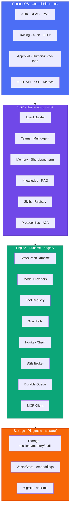

The stack is **strictly downward-flowing**: `os/` may import from `sdk/` and `engine/`, `sdk/` may import from `engine/` and `storage/`, but never the reverse. This is enforced by convention and validated in code review.

---

## 2. Package Segregation Map

Each box in the map below corresponds to a Go package under the repository root. Grey packages are lowest-level (no downward dependencies), coloured packages depend on everything below them.

```mermaid
flowchart TB
    subgraph L1["cli/ · Command-line surface"]
        cli_cmd[cli/cmd]
        cli_repl[cli/repl]
    end

    subgraph L2["os/ · Control plane HTTP surface"]
        os_srv[os · server]
        os_auth[os/auth]
        os_appr[os/approval]
        os_tr[os/trace]
        os_sch[os/scheduler]
        os_iface[os/interfaces · slack/discord/telegram]
    end

    subgraph L3["sdk/ · Agent-builder API"]
        sdk_agent[sdk/agent]
        sdk_team[sdk/team]
        sdk_mem[sdk/memory]
        sdk_know[sdk/knowledge]
        sdk_skill[sdk/skill]
        sdk_proto[sdk/protocol]
    end

    subgraph L4["engine/ · Runtime primitives"]
        eng_graph[engine/graph]
        eng_model[engine/model]
        eng_tool[engine/tool]
        eng_guard[engine/guardrails]
        eng_hooks[engine/hooks]
        eng_stream[engine/stream]
        eng_queue[engine/queue]
        eng_mcp[engine/mcp]
    end

    subgraph L5["storage/ · Persistence adapters"]
        st_iface[storage · interface]
        st_sqlite[adapters/sqlite]
        st_pg[adapters/postgres]
        st_mem[adapters/memory]
        st_qd[adapters/qdrant]
        st_others[adapters/dynamo · mongo · redis · pinecone · weaviate · milvus · chromadb · lancedb · pgvector]
        st_migrate[storage/migrate]
    end

    subgraph L6["sandbox/ · Isolation for untrusted code"]
        sb[sandbox · process · container · wasm · k8s]
    end

    cli_cmd --> sdk_agent
    cli_cmd --> os_srv
    cli_repl --> sdk_agent

    os_srv --> sdk_agent
    os_srv --> eng_stream
    os_srv --> os_auth
    os_srv --> os_appr
    os_srv --> os_tr
    os_srv --> os_sch
    os_iface --> sdk_agent

    sdk_agent --> eng_graph
    sdk_agent --> eng_model
    sdk_agent --> eng_tool
    sdk_agent --> eng_guard
    sdk_agent --> eng_hooks
    sdk_agent --> eng_mcp
    sdk_agent --> sdk_mem
    sdk_agent --> sdk_know
    sdk_agent --> sdk_skill
    sdk_agent --> st_iface
    sdk_team --> sdk_proto
    sdk_team --> sdk_agent
    sdk_know --> eng_model
    sdk_know --> st_iface
    sdk_mem --> st_iface

    eng_graph --> eng_queue
    eng_graph --> eng_stream
    eng_graph --> st_iface
    eng_tool --> sb
    eng_hooks --> st_iface

    st_sqlite --> st_iface
    st_pg --> st_iface
    st_mem --> st_iface
    st_qd --> st_iface
    st_others --> st_iface
    st_migrate --> st_iface

    classDef control fill:#4c6ef5,color:#fff,stroke:#364fc7
    classDef sdk fill:#7048e8,color:#fff,stroke:#5f3dc4
    classDef engine fill:#0ca678,color:#fff,stroke:#087f5b
    classDef storage fill:#f76707,color:#fff,stroke:#d9480f
    classDef sb fill:#e03131,color:#fff,stroke:#c92a2a
    classDef cli fill:#495057,color:#fff,stroke:#212529

    class cli_cmd,cli_repl cli
    class os_srv,os_auth,os_appr,os_tr,os_sch,os_iface control
    class sdk_agent,sdk_team,sdk_mem,sdk_know,sdk_skill,sdk_proto sdk
    class eng_graph,eng_model,eng_tool,eng_guard,eng_hooks,eng_stream,eng_queue,eng_mcp engine
    class st_iface,st_sqlite,st_pg,st_mem,st_qd,st_others,st_migrate storage
    class sb sb
```

**Rule:** there are **zero cycles**. `storage/` is the sink; `cli/` and `os/` are the sources.

---

## 3. Chat Request Lifecycle (Single Turn)

The sequence below traces `agent.Chat(ctx, "hello")` — used in the [`chat_with_tools`](https://github.com/spawn08/chronos/tree/main/examples/chat_with_tools) example.

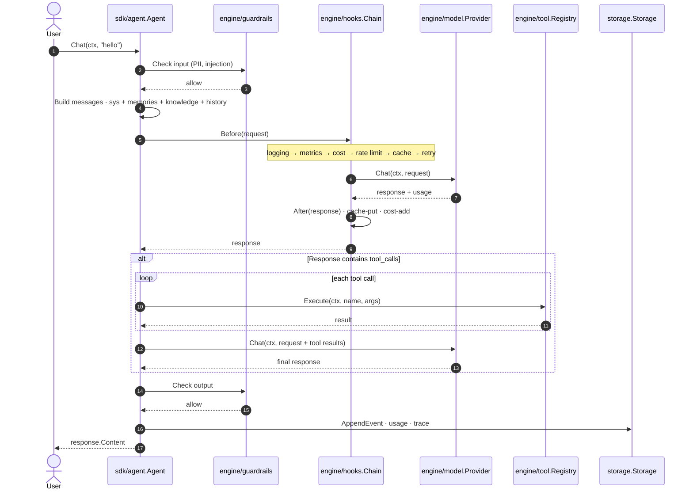

Source: [`sdk/agent/agent.go`](https://github.com/spawn08/chronos/blob/main/sdk/agent/agent.go).

---

## 4. StateGraph Execution & Durability

`StateGraph` is the durable execution engine. Every node completion is checkpointed, so a crashed run can resume on any worker.

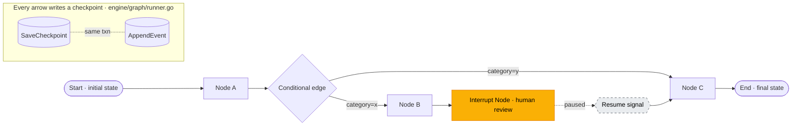

Key properties (enforced by `runner_durability_test.go`):

- **Idempotent replay** — resume never double-executes the last completed node.
- **Ordered latest-checkpoint** — `GetLatestCheckpoint` orders by `seq_num`, not wall-clock.
- **Atomic write** — checkpoint + event share a single transaction.

---

## 5. Durable Queue & Distributed Execution

For horizontal scale, `engine/queue` provides a Postgres-backed work queue with lease-based dequeue (`FOR UPDATE SKIP LOCKED`). Any worker can pick up any run.

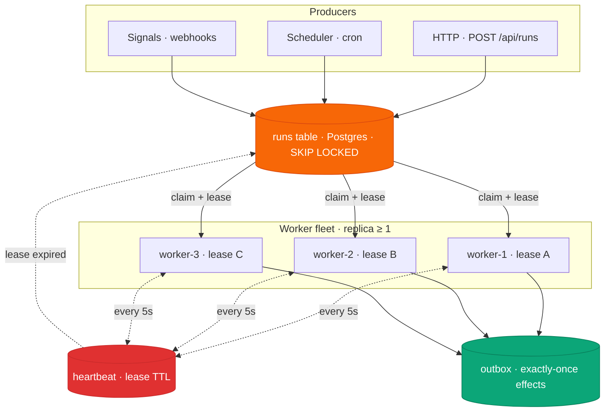

Kill any worker with `SIGKILL` — its run is re-claimed after lease expiry. See [`engine/queue/worker.go`](https://github.com/spawn08/chronos/blob/main/engine/queue/worker.go) and the [`examples/durable_queue`](https://github.com/spawn08/chronos/tree/main/examples/durable_queue) example.

---

## 6. Multi-Agent Team Strategies

`sdk/team` composes agents into teams. Five strategies are shipped, each mapped to a distinct topology.

```mermaid
flowchart TB
    subgraph Seq["Sequential · pipeline"]
        s_in([input]) --> s_a[researcher] --> s_b[writer] --> s_c[editor] --> s_out([output])
    end

    subgraph Par["Parallel · fan-out/fan-in"]
        p_in([input]) --> p_a[analyst-a]
        p_in --> p_b[analyst-b]
        p_in --> p_c[analyst-c]
        p_a --> p_merge((merge))
        p_b --> p_merge
        p_c --> p_merge
        p_merge --> p_out([output])
    end

    subgraph Router["Router · LLM-classified"]
        r_in([input]) --> r_route{{router · LLM}}
        r_route -->|technical| r_a[expert-a]
        r_route -->|general| r_b[expert-b]
        r_a --> r_out([output])
        r_b --> r_out
    end

    subgraph Coord["Coordinator · plan + delegate"]
        c_in([input]) --> c_lead[tech-lead]
        c_lead -->|delegate| c_a[backend]
        c_lead -->|delegate| c_b[frontend]
        c_a --> c_lead
        c_b --> c_lead
        c_lead --> c_out([output])
    end

    subgraph Swarm["Swarm · peer-to-peer"]
        sw_in([input]) --> sw_a[agent-a]
        sw_a <--> sw_b[agent-b]
        sw_b <--> sw_c[agent-c]
        sw_a <--> sw_c
        sw_c --> sw_out([output])
    end
```

Strategy → source file mapping:

| Strategy | File | Example |
|---|---|---|
| `sequential` | `sdk/team/sequential.go` | [`examples/multi_agent`](https://github.com/spawn08/chronos/tree/main/examples/multi_agent) |
| `parallel` | `sdk/team/parallel.go` | ↑ |
| `router` | `sdk/team/router.go` | [`examples/yaml-configs/graph-agent.yaml`](https://github.com/spawn08/chronos/tree/main/examples/yaml-configs) |
| `coordinator` | `sdk/team/coordinator.go` | ↑ |
| `swarm` / `hierarchy` | `sdk/team/swarm.go` | — |

---

## 7. Storage Segregation — Two Interfaces, Many Adapters

Storage is split into two interfaces to avoid forcing every backend to speak vector search.

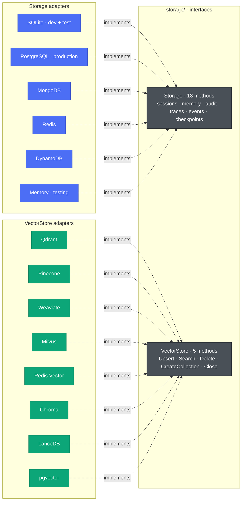

Interface locations: [`storage/storage.go`](https://github.com/spawn08/chronos/blob/main/storage/storage.go) and [`storage/vector.go`](https://github.com/spawn08/chronos/blob/main/storage/vector.go).

---

## 8. Component Reference Table

The following tables tie every diagram box back to its concrete Go source. Anchor for cross-links from other pages.

### SDK Layer (`sdk/`)

| Package | Purpose | Key Types |
|---------|---------|-----------|
| [`sdk/agent`](https://github.com/spawn08/chronos/tree/main/sdk/agent) | Agent definition, builder, sessions | `Agent`, `Builder`, `ContextConfig` |
| [`sdk/team`](https://github.com/spawn08/chronos/tree/main/sdk/team) | Multi-agent orchestration | `Team`, `Strategy`, `RouterFunc` |
| [`sdk/protocol`](https://github.com/spawn08/chronos/tree/main/sdk/protocol) | Agent-to-agent bus | `Bus`, `Envelope`, `DirectChannel` |
| [`sdk/memory`](https://github.com/spawn08/chronos/tree/main/sdk/memory) | Short/long-term memory + LLM extraction | `Store`, `Manager`, `MemoryTool` |
| [`sdk/knowledge`](https://github.com/spawn08/chronos/tree/main/sdk/knowledge) | RAG: doc loading + vector search | `Knowledge`, `VectorKnowledge` |
| [`sdk/skill`](https://github.com/spawn08/chronos/tree/main/sdk/skill) | Skill metadata registry | `Skill`, `Registry` |

### Engine Layer (`engine/`)

| Package | Purpose | Key Types |
|---------|---------|-----------|
| [`engine/graph`](https://github.com/spawn08/chronos/tree/main/engine/graph) | Durable StateGraph execution | `StateGraph`, `CompiledGraph`, `Runner`, `State` |
| [`engine/model`](https://github.com/spawn08/chronos/tree/main/engine/model) | LLM provider implementations | `Provider`, `ChatRequest`, `ChatResponse`, `FallbackProvider` |
| [`engine/tool`](https://github.com/spawn08/chronos/tree/main/engine/tool) | Tool registry with permissions | `Registry`, `Definition`, `Handler`, `Permission` |
| [`engine/guardrails`](https://github.com/spawn08/chronos/tree/main/engine/guardrails) | I/O validation | `Engine`, `Guardrail`, `BlocklistGuardrail`, `MaxLengthGuardrail` |
| [`engine/hooks`](https://github.com/spawn08/chronos/tree/main/engine/hooks) | Before/after middleware | `Hook`, `Chain`, `MetricsHook`, `CostTracker`, `CacheHook`, `RetryHook`, `RateLimitHook` |
| [`engine/stream`](https://github.com/spawn08/chronos/tree/main/engine/stream) | SSE event broker | `Broker`, `Event` |
| [`engine/queue`](https://github.com/spawn08/chronos/tree/main/engine/queue) | Durable work queue | `Queue`, `Worker`, `Lease` |
| [`engine/mcp`](https://github.com/spawn08/chronos/tree/main/engine/mcp) | Model Context Protocol client | `Client`, `Adapter` |

### Storage Layer (`storage/`)

| Adapter | Interface | Use Case |
|---------|-----------|----------|
| SQLite | `Storage` | Development, tests, single-node |
| PostgreSQL | `Storage` | Production, multi-node, durable queue |
| Redis | `Storage` | High-throughput caching |
| MongoDB | `Storage` | Document workloads |
| DynamoDB | `Storage` | Serverless AWS |
| Memory | `Storage` | Unit tests |
| Qdrant | `VectorStore` | Self-hosted vector DB |
| Pinecone | `VectorStore` | Managed vector DB |
| Weaviate | `VectorStore` | Hybrid search |
| Milvus | `VectorStore` | Large-scale similarity |
| pgvector | `VectorStore` | Postgres-native vectors |
| Chroma / LanceDB | `VectorStore` | Embedded workloads |

### ChronosOS (`os/`)

| Package | Purpose |
|---------|---------|
| [`os` (server)](https://github.com/spawn08/chronos/blob/main/os/server.go) | HTTP API: sessions, traces, SSE, health, metrics |
| [`os/auth`](https://github.com/spawn08/chronos/tree/main/os/auth) | JWT + API-key RBAC |
| [`os/approval`](https://github.com/spawn08/chronos/tree/main/os/approval) | Human-in-the-loop approval service |
| [`os/trace`](https://github.com/spawn08/chronos/tree/main/os/trace) | Span collector + OTLP export |
| [`os/scheduler`](https://github.com/spawn08/chronos/tree/main/os/scheduler) | Cron/one-shot scheduled runs |
| [`os/interfaces`](https://github.com/spawn08/chronos/tree/main/os/interfaces) | Slack, Discord, Telegram bots |

---

## 9. Deployment Topologies

Chronos scales from a single binary to a Kubernetes fleet without code changes.

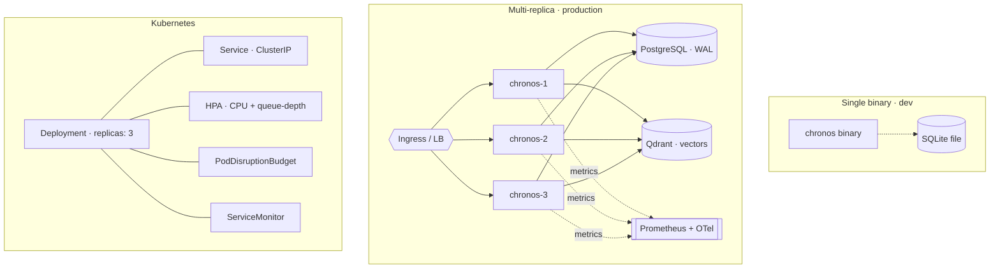

See the [Kubernetes](/deployment/kubernetes) and [Docker](/deployment/docker) guides for concrete manifests.

---

## 10. Sandbox Isolation

Untrusted code (LLM-generated shell, file writes) runs through `sandbox/` with pluggable backends.

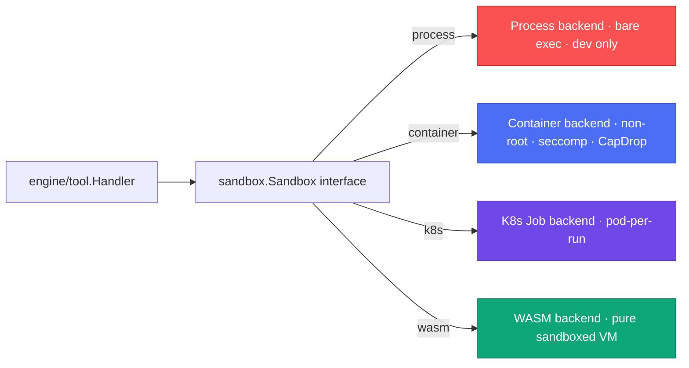

Default is `process` for developer ergonomics; production deployments must select `container` or `k8s`. See [`sandbox/sandbox.go`](https://github.com/spawn08/chronos/blob/main/sandbox/sandbox.go).

---

## 11. Human-in-the-Loop: Pause & Resume

An **interrupt node** pauses a run and persists a checkpoint. After a human decision is recorded through the approval service, `Resume` advances past that one interrupt exactly once — any *downstream* interrupt still pauses.

```mermaid
sequenceDiagram
    autonumber
    actor Human
    participant API as ChronosOS API
    participant AP as os/approval
    participant R as engine/graph.Runner
    participant S as storage.Storage

    R->>S: reach interrupt → commit(checkpoint), Status=Paused
    Note over R,S: run is now durable; the process may exit
    Human->>API: GET /api/approval/pending
    API->>AP: HandlePending()
    AP-->>Human: pending approvals (session, node)
    Human->>API: POST /api/approval/respond {approve}
    API->>AP: HandleRespond()
    AP->>S: record decision
    API->>R: Resume(ctx, runID, skipFirstInterrupt=true)
    R->>S: load latest checkpoint
    R->>R: skip the resumed interrupt once, then run on
    R-->>API: RunState (Running → Completed)
```

See the [`examples/durable_hitl`](https://github.com/spawn08/chronos/tree/main/examples/durable_hitl) example.

---

## 12. Tool Calls: Permission & Approval

When the model requests a tool, the registry consults the tool's `Permission`. Auto-allowed tools run immediately; sensitive tools route through the approval service before executing.

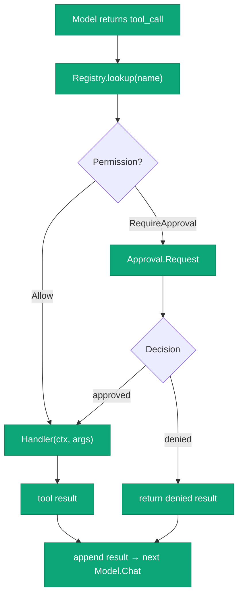

---

## 13. MCP Transports — stdio & HTTP+SSE

Chronos is an MCP **client**. It handshakes with a server, imports the advertised tools, and proxies calls. Two transports share the same client API (`Connect`, `ListTools`, `CallTool`, `Close`).

```mermaid
sequenceDiagram
    autonumber
    participant AG as sdk/agent.Agent
    participant C as engine/mcp.Client
    participant P as Server (stdio subprocess)
    AG->>C: ConnectMCP → Connect(ctx)
    C->>P: spawn command; JSON-RPC "initialize"
    P-->>C: serverInfo + capabilities
    C->>P: notify "initialized"
    AG->>C: ListTools(ctx)
    C->>P: "tools/list"
    P-->>C: tools[]
    C-->>AG: register each tool in Registry
    AG->>C: CallTool(name, args)
    C->>P: "tools/call"
    P-->>C: content
    C-->>AG: result
```

The **HTTP+SSE** transport (MCP 2024-11-05) targets *remote* servers: the client opens an SSE stream, learns the POST endpoint the server advertises, and correlates responses back over the stream by JSON-RPC id.

```mermaid
sequenceDiagram
    autonumber
    participant C as engine/mcp.Client
    participant S as Remote MCP Server
    C->>S: GET /sse (Accept: text/event-stream)
    S-->>C: event: endpoint · data: /messages
    Note over C: a background reader parses the stream
    C->>S: POST /messages {"initialize", id=1}
    S-->>C: SSE message {id=1, result}
    C->>S: POST /messages {"tools/call", id=2}
    S-->>C: SSE message {id=2, result}
    Note over C,S: per-call ctx unblocks a pending wait; Close() cancels the reader
```

See the [MCP guide](/guides/mcp) and the [`examples/mcp_sse`](https://github.com/spawn08/chronos/tree/main/examples/mcp_sse) / [`examples/mcp_agent`](https://github.com/spawn08/chronos/tree/main/examples/mcp_agent) examples.

---

## 14. Core Extension Interfaces

Extending Chronos means implementing one of these small interfaces — the seam an adapter, provider, or plugin plugs into.

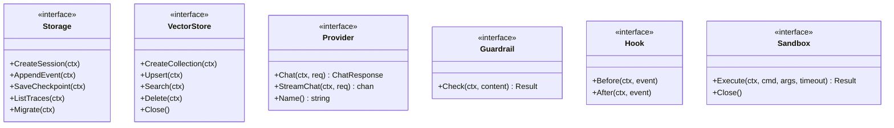

| Interface | Defined in | Implement to add… |
|---|---|---|
| `storage.Storage` | `storage/storage.go` | a relational / NoSQL backend |
| `storage.VectorStore` | `storage/vector.go` | a vector database |
| `model.Provider` | `engine/model/provider.go` | a chat model backend |
| `model.EmbeddingsProvider` | `engine/model/embeddings.go` | an embeddings backend |
| `guardrails.Guardrail` | `engine/guardrails/guardrails.go` | input/output validation |
| `hooks.Hook` | `engine/hooks/hooks.go` | call middleware (composed via `Chain`) |
| `sandbox.Sandbox` | `sandbox/sandbox.go` | an isolation backend |

---

## 15. Where to go next

- [**Real-World Agents**](/guides/real-world-agents) — walk-throughs for chat, RAG, teams, HITL, streaming with runnable Go and YAML.
- [**CLI Reference**](/api/cli) — every subcommand with copy-paste invocations.
- [**Interfaces**](/api/interfaces) — the exact Go signatures each layer must satisfy.
- [**Durable Execution**](/guides/durable-execution) — deep dive on the queue, checkpoints, and resume semantics.
- [**Scaling Best Practices**](/guides/scaling-best-practices) — going from 1 replica to N.
