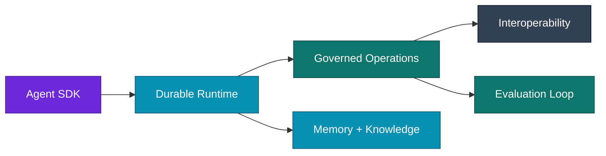
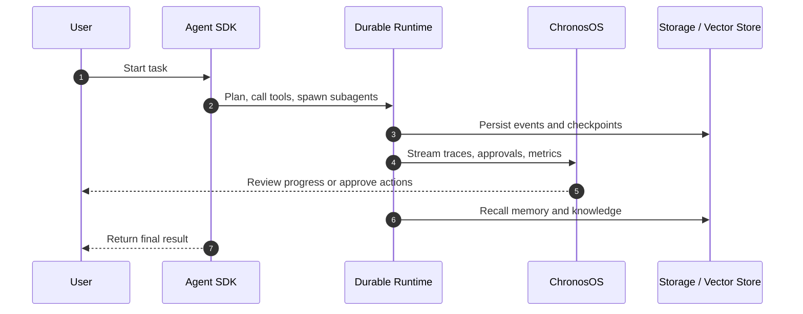

Chronos is distributed as a Go module (`github.com/spawn08/chronos`), cross-platform CLI binaries, and a container image. Tagged releases include checksums, an SBOM, and signed artifacts. See [CLI Install](getting-started/cli-install.md) for installation options.

## v0.13.0 — Visual debugger and YAML-native durable graphs

- **Dashboard (visual studio)** — a new `/dashboard/` UI and `/api/dashboard/*` API on ChronosOS: checkpoint history, graph topology, per-session cost, and resume/time-travel actions against a compiled `graph.Runner`, reusing the existing sessions/traces/streaming/approval endpoints instead of duplicating them.
- **YAML-declarative durable graphs** — an agent's YAML config can declare a `graph:` block (`model`/`tool`/`subagent`/`passthrough` node types, static/conditional edges, human-in-the-loop interrupts) compiling to a real `graph.StateGraph`; `durable: true` auto-registers it with `chronos serve`'s dashboard.
- **`POST /api/dashboard/runs`** — starts a brand-new run against a registered graph; previously nothing in ChronosOS's HTTP surface could start a run at all, only resume or time-travel a session some in-process caller had already created.
- **`chronos auth token`** — mints a local dev credential (API key or JWT) matching the server's active `CHRONOS_AUTH` mode.
- **Machine-readable CLI output** — `--json` prints `run`/`team run` output as a single JSON object instead of human-readable text; `--output-schema <file>` requests ad hoc structured output without a pre-configured agent.
- **Structured output is now actually enforced** — `output_schema:`/`WithOutputSchema` sends the JSON Schema to the provider's native structured-output parameter (OpenAI, Azure OpenAI, OpenAI-compatible providers, Gemini, the Responses API) instead of only validating the reply after the fact.
- **`--stream`/`-s`/`--no-stream` fixed** — now a global flag like `--debug`/`--trace`, so it works anywhere on the command line instead of only after the subcommand.
- **CI**: pinned Go toolchain bumped to 1.25.13 (fixes 7 upstream stdlib CVEs).

## v0.12.2

- **Release maintenance** — publishes the current Chronos `main` branch as a patch release with refreshed release metadata and artifacts.

## v0.12.1

- **YAML-defined skills** — agents can declare skills in YAML config, loaded via a new `sdk/skill` loader with metadata and versioning support.
- **MCP client/adapter improvements** — refinements to the MCP tool adapter and client.
- **`deploy` CLI cleanup** — simplified `cli/cmd/deploy.go` and expanded `sandbox-deploy.yaml` example.
- **Team hierarchy/swarm fixes** — small correctness fixes in `sdk/team`.

## v0.12.0 — Azure reasoning and observable team streaming

- **Azure Responses API** — native Azure reasoning automatically uses `/openai/v1/responses`, supports function tools, and preserves encrypted reasoning state across stateless tool rounds.
- **Observable team streaming** — team runs honor YAML streaming preferences, forward provider-approved reasoning summaries, expose effective runtime settings, and report stream failures instead of silently falling back to blocking execution.
- **Reliable traces** — SQLite and PostgreSQL trace writes now upsert span completion data, including output, errors, and `ended_at`; CLI output resolves relative SQLite paths so trace databases are easy to locate.
- **Runtime overrides** — `--no-debug` and `--no-trace` explicitly override enabled YAML settings, complementing the existing positive flags.
- **Safer diagnostics** — PostgreSQL DSNs are redacted from configuration output while Azure model deployment names and reasoning-summary settings are displayed clearly.

## v0.11.0 — CLI runtime control

- **Session approval bypass** — enter `a` at an interactive tool prompt to approve the rest of the CLI session, use `--permission-mode auto_approve`, or use the explicit `--dangerously-skip-permissions` shortcut. Explicitly denied tools remain blocked.
- **Declarative tool policy** — YAML tools now accept `permission`, `requires_confirmation`, and `requires_user_input`; agents accept `permission_mode`.
- **Streaming preference** — YAML `stream` is honored by REPL and headless runs, with `--stream` and `--no-stream` overrides.
- **Native reasoning** — normalized reasoning configuration maps to OpenAI reasoning effort, Anthropic thinking budgets, and Gemini thinking configuration; reasoning output remains separate from final answer text.
- **CLI observability** — YAML/CLI debug and trace controls wire model/tool spans for blocking and streaming execution.
- **Progressive YAML gallery** — the documentation now separates simple agents, intermediate routers/pipelines, advanced teams, production governance, provider recipes, and CLI reference into focused pages.

## v0.10.2 — CLI approval reliability

This patch release improves interactive CLI approval handling for tool calls that require human review.

- **Interactive approvals** — the CLI now prompts correctly when an agent requests approval-gated tool execution, keeping terminal sessions responsive and explicit.

## v0.10.1 — YAML provider resolution

This patch release strengthens YAML-based agent configuration.

- **Model provider resolution** — YAML model configuration now resolves providers more defensively, improving reliability for declarative agent setups.

## v0.10.0 — Production agent platform

This release focuses on the capabilities required to move from prototype agents to durable, governed, production-ready systems.

### Highlights

- **Deep agent harness** — planning, virtual filesystem, context compaction, semantic memory recall, and context-isolated subagents can now be enabled together through `harness.NewDeepAgent(...)`.
- **Durable delegation** — subagents run in isolated contexts, can be defined dynamically, and execute through the same durable queue used by long-running agent work.
- **Interoperability** — Chronos agents can integrate with MCP, A2A, and AG-UI for tool sharing, agent-to-agent collaboration, and standard UI event streams.
- **Memory and knowledge improvements** — semantic recall, batched embedding, chunking, query caching, and relevance thresholds improve retrieval quality for larger workloads.
- **Evaluation workflow** — trace capture, dataset generation, evaluator runs, CI gates, and historical trend queries are available through `chronos evals` commands.
- **Operational foundation** — distributed execution, checkpoints, approvals, rate limits, tracing, audit logs, hardened auth, sandboxing, Helm deployment, and signed release artifacts are part of the standard platform.

### Key flows

### Documentation

- [Deep Agent guide](guides/deep-agent.md)
- [Planning guide](guides/planning.md)
- [Virtual Filesystem guide](guides/virtual-filesystem.md)
- [Subagents guide](guides/subagents.md)
- [Context Management guide](guides/context-management.md)
- [MCP guide](guides/mcp.md)
- [A2A guide](guides/a2a.md)
- [AG-UI guide](guides/agui.md)
- [Semantic Recall guide](guides/semantic-recall.md)
- [Eval Loop guide](guides/eval-loop.md)

For commit-level details, review the tagged release on [GitHub Releases](https://github.com/spawn08/chronos/releases).
